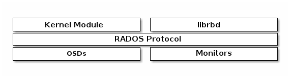

# Ceph Block Storage
Ceph Block device 提供了 thin-provison / 可調整大小 / 分散儲存 / 快照 / 一致性 … 等功能。

Ceph block storage 除了可以被 Linux kernel 直接使用外，也可以被 KVM / Qemu 使用，也可以透過 LIBRBD 與其他雲端系統(例如：OpenStack、CloudStack)整合。




# Create Pools
**Setp 1 - 建立Pool提供儲存池**
```sh
ceph osd pool create kairen_pool 128
```
**Setp 2 - 建立4G的Image於kairen_pool中**
```sh
rbd create cache --size 4096 --pool kairen_pool
```
**How to judge PG number :**
> * Less than 5 OSDs set pg_num to 128
> * Between 5 and 10 OSDs set pg_num to 512
> * Between 10 and 50 OSDs set pg_num to 4096
> * If you have more than 50 OSDs, you need to understand the tradeoffs and how to calculate the pg_num value by yourself

**檢查 pool中的image與rbd --image {image-name} info**
```sh
rbd ls kairen_pool
rbd --image cache info --pool kairen_pool
```
**重新配置images大小**
```sh
rbd resize --image cache --size 20 --pool kairen_pool
```
**儲存與恢復資料**
```sh
echo "abc" > testfile.txt
rados put test-object-1 testfile.txt --pool=data
```
> 儲存 一個物件到一個資料池(data pool)

**檢查物件資訊**
```sh
rados -p data ls
```
**檢查物件位置**
```sh
ceph osd map data test-object-1
```
> As the cluster evolves, the object location may change dynamically.

**刪除一個pool中的物件**
```sh
rados rm test-object-1 --pool=data
```


# 掛載block device
**Step 1 - 掛載rbd內核模組**
```sh
sudo modprobe rbd
```
**Step 2 - 建立一個4G的image**
```sh
rbd create --size 4096 test
```
**Step 3 - 將test這個image map到rbd pool**
```sh
rbd map test --pool rbd
```

**Step 4 - 接著就能愉快地使用block device**
```sh
$ mkdf.ext4 /dev/rbd1
$ mount /dev/rbd1 /mnt
```

# 備份
轉換成 qemu-image：
```sh
$ qemu-img convert -O raw rbd:<pool>/<rbd-images> <destination-snapshot-file>
```

轉換成 raw images：
```sh
```

# 參考
* [Ceph Block Storage Device](http://mqjing.blogspot.tw/2015/02/ceph-installation-how-to-install-ceph_78.html)
* [iSCSI 參考](http://pjack1981.blogspot.tw/2011/09/export-ceph-rbd-with-iscsi.html)
